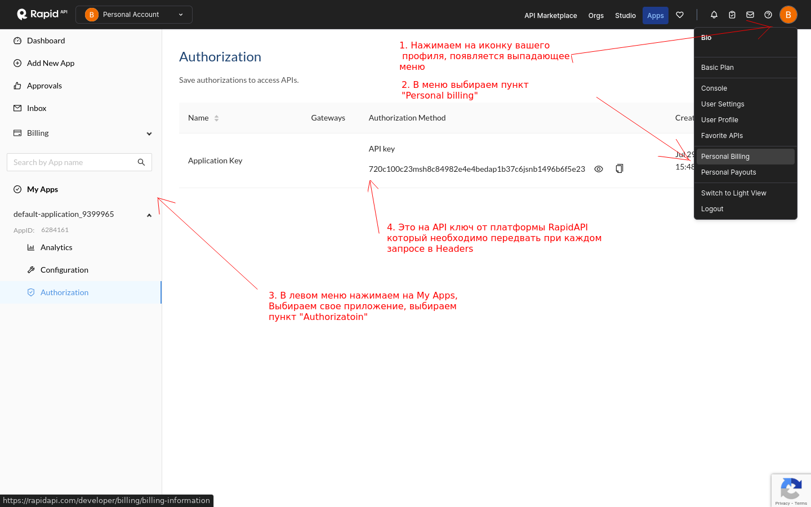
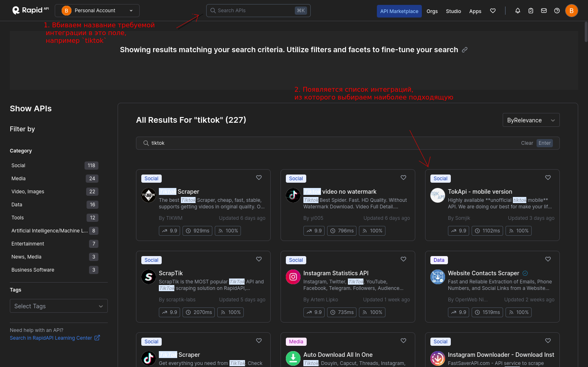

# Описание платформы RapidAPI

# Регистрация

Переходим по ссылке и регистрируем новый аккаунт: https://rapidapi.com/

# Получение API ключа от RapidAPI

После регистрации переходим на страницу "Billing Information"

https://rapidapi.com/developer/billing/billing-information

В левом списке, под заголовком "My Apps" выбираем свое приложение.

Раскрывается выпадающий список в котором нажимаем на пункт "Authorization"

Должен отобразиться список API ключей, в котором будет наш ключ вида:

`720c100c23msh8c84982e4e4bedap1b37c6jsnb00000`

# Выбор API интеграции из готовой библиотеки

Переходим на страницу https://rapidapi.com/hub

Наверху в строке поиска вбиваем название нужной интеграции, например `tiktok`

Появляется список с найденными интеграциями, выбираем наиболее подходящую.

# Выбор подходящей интеграции

Нам необходимы интеграции в которой есть запрос `Search API -> Search video`

Список подходящих интеграций:

[Tiktok Scraper](https://rapidapi.com/tikwm-tikwm-default/api/tiktok-scraper7) - 300 запросов/месяц на тестовом аккаунте

[TokApi mobile version](https://rapidapi.com/Sonjik/api/tokapi-mobile-version/playground/apiendpoint_c8170e5b-b597-4cd5-b9c3-e00020f355f8) - 100 запосов в месяц на тестовом аккаунте

etc

# TokApi mobile version python library

Данная интеграция также имеет свой python пакет на github

https://github.com/mtokapi/tokapi-client

Подклчение в Poetry:

`tokapi-client = "0.0.3"`
